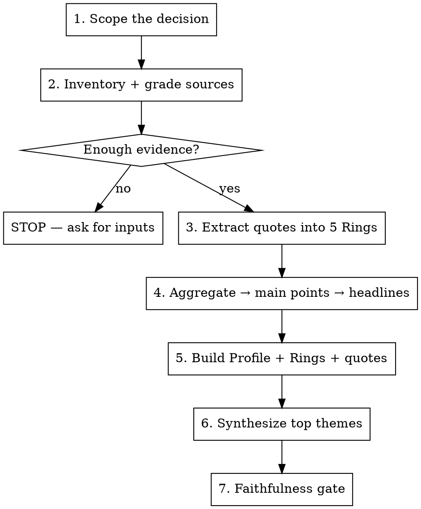

# buyer-personas

## Overview

A buyer persona built this way is **not a demographic profile**. It is a structured, evidence-grounded account of how a defined group of buyers makes one specific **buying decision** — expressed in the buyer's own words.

Core principle (Kraus & Revella, *Buyer Personas*): **focus on the buying decision, not the buyer's biography.** Age, gender, a stock photo, and invented "a day in the life" narratives do not change a marketing decision and are explicitly discouraged. What changes decisions is understanding why buyers decide to act, what outcomes they want, what scares them, what they compare, and how they buy.

The deliverable is organized around the **5 Rings of Buying Insight** + a lean **Buyer Profile** + **top themes**. Every insight is supported by **verbatim buyer quotes with their source annotated**. Nothing is invented.

**REQUIRED REFERENCE:** Read [references/five-rings.md](references/five-rings.md) before extracting — it contains the precise definition of each Ring, the extraction prompts, the Success-Factor-vs-Decision-Criteria disambiguation, source-selection rules, and the faithfulness rules. Do not work from this summary alone.

## When to use

- "Make/build a buyer persona for [client / segment / service]"
- "Turn these call transcripts / Fathom recordings / reviews into a persona"
- "What actually drives buyers of [X]?" / "Why are we losing these deals?"
- Refreshing or auditing an existing persona against real buyer evidence

**When NOT to use:** generic ICP firmographics for ad targeting only; a one-paragraph "customer avatar" for a quick exercise; anything where you have zero buyer-derived input and would have to invent it (see the no-evidence rule below).

## The Iron Rule: evidence or nothing

A persona is only as good as its inputs. **Interviews/transcripts with recent buyers are the foundation.** If you have no buyer-derived evidence (transcripts, interviews, reviews, survey verbatims, real won/lost notes), STOP and tell the user — do not manufacture a persona from the company's own marketing or from general knowledge. A fabricated persona is worse than none because teams will trust it.

Best sources, in order of value (see five-rings.md for detail):
1. Buyers who considered you but **chose a competitor** (most valuable — tells you what went wrong)
2. Buyers who **chose the status quo** (did nothing)
3. Buyers who never considered you
4. Buyers who **chose you** (useful, but don't over-weight — only shows where you got it right)

If the inputs are all Group 4 (happy customers), say so and flag the resulting blind spot.

## Workflow



1. **Scope the decision.** Answer three study-design questions (ask the user if unclear, don't guess):
   - *What single buying decision* is this persona about? (e.g., "choosing a residential pest control provider," not "pest control" broadly.)
   - *Which target buyers* matter? (segment, geography, company size, residential vs commercial, etc.)
   - *Whose perspective* — who does the work of evaluating? (Interview/transcript the person who actually compares options, not just the economic buyer.)
   One persona = one decision + one group of like-minded buyers. If the evidence clearly contains two different mindsets, build two personas.

2. **Inventory and grade sources.** List every input and tag which buyer group it represents (chose-you / chose-competitor / status-quo / never-considered). Note recency. Flag thinness. If the user needs to gather raw material themselves (e.g., run buyer interviews) before there's enough evidence to proceed, five-rings.md has an interview-technique section (~its lines 111-123).

3. **Extract into the 5 Rings.** Read every source. Pull **verbatim quotes** that answer each Ring's question, tagging each `PI / SF / PB / DC / BJ` and recording its source. Use the per-Ring extraction prompts in five-rings.md. Pull more than you'll keep.

4. **Aggregate → main points → headlines.** Group quotes per Ring. Write a short *main point* for each cluster, then a **Buying Insight Headline** written in the buyer's voice — a question or statement the way a buyer would ask/say it (e.g. *"How fast can you actually get someone to my house?"*). Keep at most **one quote per buyer per insight** (the most vivid one). Note how many distinct buyers support each insight.

5. **Build the persona document.** Use the output template below: lean Buyer Profile, then all 5 Rings (headline + supporting verbatim quotes with sources), then themes.

6. **Synthesize top themes.** Look *across* the first four Rings (PI, SF, PB, DC — not BJ) for 5–8 higher-order buyer needs that connect multiple insights. Tag each theme with the Rings that feed it. These are what messaging should lead with.

7. **Faithfulness gate** (see five-rings.md): every insight traces to a quote; quotes only *lightly* edited (drop filler/half-phrases, never insert your words, sanitize, or summarize them away); sources annotated; thin or empty Rings flagged honestly; zero invented demographics, quotes, or numbers.

## Auditing an existing persona

When the ask is to refresh or audit a persona that already exists (rather than build one fresh):

- Read the existing persona document in full before touching anything.
- Gather the same evidence sources the build workflow uses (transcripts, interviews, reviews, won/lost notes) — prefer new/recent evidence over what the persona was originally built from.
- Check each claim in the persona against the evidence: does a quote or paraphrase actually support it? Flag any claim with no supporting evidence.
- Check for buying-insight gaps across the 5 Rings — has new evidence surfaced anything the existing Rings miss (new Priority Initiative, a Barrier that's disappeared, a shifted Decision Criterion)?
- Deliver a verdict per claim: **keep** (well-supported), **revise** (partially supported, needs re-wording), or **unsupported** (no evidence found — recommend cutting).

## Output template

```markdown
# Buyer Persona: <name/handle> — <the buying decision>

> Decision in focus: <one line>  ·  Built from: <N sources, which buyer groups, date range>
> ⚠️ Evidence gaps: <thin rings / missing buyer groups, or "none">

## Buyer Profile
- **Market segment:** …
- **Role / who they are:** …  (B2B: Reports to / Education if relevant)
- **Solution they're choosing:** …
- **Responsibilities for the decision:** <short narrative from the insights>
- **Top priorities this year:** <if surfaced; may be unrelated to the purchase>
- **Resources I trust:** <where they go for info — directly from the evidence>

## The 5 Rings of Buying Insight

### 1. Priority Initiatives — what triggers the search
**Headline (buyer's voice):** "…"
> "verbatim quote" — Source
> "verbatim quote" — Source

### 2. Success Factors — outcomes they expect
…
### 3. Perceived Barriers — fears / why they pick someone else / why they stall
…
### 4. Decision Criteria — what they compare and evaluate
…
### 5. Buyer's Journey — who's involved, steps, info sources
…

## Top Themes That Will Resonate (5–8)
1. **<theme>** — <why it matters> (PI, SF, DC)
2. …
```

## Common mistakes

| Mistake | Fix |
|--------|-----|
| Leading with features/benefits you wish buyers cared about | Let Decision Criteria and Success Factors come from what buyers actually said. |
| Confusing Success Factors with Decision Criteria | SF = the *why/outcome*; DC = the *what/how/capability compared*. See five-rings.md. |
| Only interviewing happy customers (Group 1) | Flag the blind spot; prioritize chose-competitor and status-quo buyers. |

For the rest — inventing quotes, building from company messaging, demographic theater, over-sanitizing, blending two mindsets — see the Faithfulness rules in [references/five-rings.md](references/five-rings.md) (~its lines 99-107); that list is canonical, this table isn't a second copy of it.

## Andrew/Pesty note

Primary raw material here is usually **Fathom** sales/discovery/client call transcripts (use the Fathom MCP tools to pull them) plus reviews and CRM won/lost notes. A client's *prospects deciding on a pest-control provider* and the client's *own buying decision to hire Pesty* are two different personas — scope which one first.

---

> Maintained by [Pesty Marketing](https://pestymarketing.com) · Browse the [full skill catalog](https://pestymarketing.com/agent-skills/).
